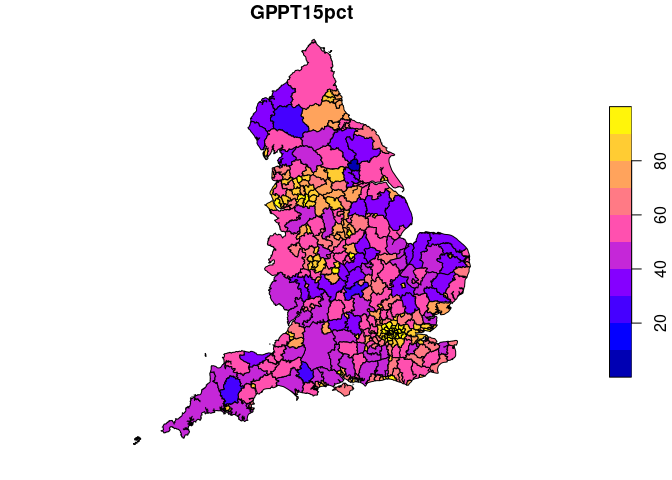

<!-- badges: start -->
<!-- [](https://github.com/datasciencecampus/jtstats-r/actions/workflows/R-CMD-check.yaml) -->
<!-- badges: end -->
<!-- README.md is generated from README.Rmd. Please edit that file -->

# jtstats

<!-- badges: start -->
<!-- badges: end -->

The goal of jtstats is to enable easy import of the Department for
Transport’s Journey Times Statistics (JTS).

## Installation

You can install the development version of jtstats from
[GitHub](https://github.com/) with:

``` r
# install.packages("remotes")
remotes::install_github("datasciencecampus/jtstats-r")
# # Or for local development, uncomment the following::
# remotes::install_local(".")
# devtools::load_all() # or Ctlr+Shift+B
```

## Usage

Load the package as follows:

``` r
library(jtstats)
```

For the purposes of this README we will also load the tidyverse
metapackage:

``` r
library(tidyverse)
```

To see what tables are available you can browse [the JTS website on
gov.uk](https://www.gov.uk/government/statistical-data-sets/journey-time-statistics-data-tables-jts).
Alternatively, you can check the datasets from within R:

``` r
dim(jts_tables)
#> [1] 192   6
head(jts_tables)
#> # A tibble: 6 × 6
#>   table_type                            table_ti…¹ table…² sheet csv_f…³ table…⁴
#>   <chr>                                 <chr>      <chr>   <chr> <chr>   <chr>  
#> 1 Journey times to key services (JTS01) Average m… jts0101 JTS0… jts010… https:…
#> 2 Journey times to key services (JTS01) Average m… jts0102 2014  jts010… https:…
#> 3 Journey times to key services (JTS01) Average m… jts0102 2015  jts010… https:…
#> 4 Journey times to key services (JTS01) Average m… jts0102 2016  jts010… https:…
#> 5 Journey times to key services (JTS01) Average m… jts0102 2017  jts010… https:…
#> 6 Journey times to key services (JTS01) Average m… jts0102 2019  jts010… https:…
#> # … with abbreviated variable names ¹​table_title, ²​table_code, ³​csv_file,
#> #   ⁴​table_url
```

As the above output shows, there are 192 separate tables that constitute
the JTS dataset. JTS tables are divided into different table types:

``` r
unique(jts_tables$table_type)
#> [1] "Journey times to key services (JTS01)"                           
#> [2] "User access to key services by journey time (JTS02)"             
#> [3] "Number of key services by journey time (JTS03)"                  
#> [4] "Journey times to key services by local authority (JTS04)"        
#> [5] "Journey times to key services by lower super output area (JTS05)"
#> [6] "Journey times connectivity (JTS09)"                              
#> [7] "Ad hoc journey times analysis (JTS10)"
```

You can search for specific JTS tables with `lookup_jts_table()`:

``` r
jts04_gps = lookup_jts_table(type = "jts04", purpose = "GPs")
#> Matching tables by type (jts04):
#> Travel time, destination and origin indicators for employment centres by mode of travel and local authority, England
#> Travel time, destination and origin indicators for primary schools by mode of travel and local authority, England
#> Travel time, destination and origin indicators for secondary schools by mode of travel and local authority, England
#> Travel time, destination and origin indicators for further education by mode of travel and local authority, England
#> Travel time, destination and origin indicators for GPs by mode of travel and local authority, England
#> Travel time, destination and origin indicators for hospitals by mode of travel and local authority, England
#> Travel time, destination and origin indicators for food stores by mode of travel and local authority, England
#> Travel time, destination and origin indicators for town centres by mode of travel and local authority, England
#> Travel time, destination and origin indicators to Pharmacy by cycle and car, local authority, England
#> 
#> Matching tables by purpose (jts04):
#> Travel time, destination and origin indicators for GPs by mode of travel and local authority, England
jts04_gps$table_title
#> [1] "Travel time, destination and origin indicators for GPs by mode of travel and local authority, England"
#> [2] "Travel time, destination and origin indicators for GPs by mode of travel and local authority, England"
#> [3] "Travel time, destination and origin indicators for GPs by mode of travel and local authority, England"
#> [4] "Travel time, destination and origin indicators for GPs by mode of travel and local authority, England"
#> [5] "Travel time, destination and origin indicators for GPs by mode of travel and local authority, England"
#> [6] "Travel time, destination and origin indicators for GPs by mode of travel and local authority, England"
jts04_gps$sheet
#> [1] "2014"         "2015_REVISED" "2016"         "2017"         "2019"        
#> [6] "LA_Metadata"
```

As an example, our packages allow easy retrieval of data on the average
journey time to employment centres (with 100 to 499 jobs) by public
transport simply by running the following lines of code:

``` r
jts_df = get_jts(type = "jts05", purpose = "employment", sheet = 2019)
#> Matching tables by type (jts05):
#> Travel time, destination and origin indicators for Employment centres by mode of travel, Lower Super Output Area (LSOA), England
#> Travel time, destination and origin indicators for Primary schools by mode of travel, Lower Super Output Area (LSOA), England
#> Travel time, destination and origin indicators for Secondary schools by mode of travel, Lower Super Output Area (LSOA), England
#> Travel time, destination and origin indicators for Further education by mode of travel, Lower Super Output Area (LSOA), England
#> Travel time, destination and origin indicators for GPs by mode of travel, Lower Super Output Area (LSOA), England
#> Travel time, destination and origin indicators for Hospitals by mode of travel, Lower Super Output Area (LSOA), England
#> Travel time, destination and origin indicators for Food stores by mode of travel, Lower Super Output Area (LSOA), England
#> Travel time, destination and origin indicators for town centres by mode of travel, Lower Super Output Area (LSOA), England
#> Travel time, destination and origin indicators to Pharmacies by cycle and car, Lower Super Output Area (LSOA), England
#> 
#> Matching tables by purpose (jts05):
#> Travel time, destination and origin indicators for Employment centres by mode of travel, Lower Super Output Area (LSOA), England
#> 
#> Matching tables by sheet (jts05, employment, 2019):
#> jts0501-2019_REVISED.csv
#> Warning: One or more parsing issues, call `problems()` on your data frame for details,
#> e.g.:
#>   dat <- vroom(...)
#>   problems(dat)
```

Imagine you’re interested in how average travel time to GP services
changed between 2017 and 2019. You can do that as follows:

``` r
jts_las_gps_2017 = get_jts(type = "jts04", purpose = "GPs", sheet = 2017)
#> Matching tables by type (jts04):
#> Travel time, destination and origin indicators for employment centres by mode of travel and local authority, England
#> Travel time, destination and origin indicators for primary schools by mode of travel and local authority, England
#> Travel time, destination and origin indicators for secondary schools by mode of travel and local authority, England
#> Travel time, destination and origin indicators for further education by mode of travel and local authority, England
#> Travel time, destination and origin indicators for GPs by mode of travel and local authority, England
#> Travel time, destination and origin indicators for hospitals by mode of travel and local authority, England
#> Travel time, destination and origin indicators for food stores by mode of travel and local authority, England
#> Travel time, destination and origin indicators for town centres by mode of travel and local authority, England
#> Travel time, destination and origin indicators to Pharmacy by cycle and car, local authority, England
#> 
#> Matching tables by purpose (jts04):
#> Travel time, destination and origin indicators for GPs by mode of travel and local authority, England
#> 
#> Matching tables by sheet (jts04, GPs, 2017):
#> jts0405-2017.csv
jts_las_gps_2019 = get_jts(type = "jts04", purpose = "GPs", sheet = 2019)
#> Matching tables by type (jts04):
#> Travel time, destination and origin indicators for employment centres by mode of travel and local authority, England
#> Travel time, destination and origin indicators for primary schools by mode of travel and local authority, England
#> Travel time, destination and origin indicators for secondary schools by mode of travel and local authority, England
#> Travel time, destination and origin indicators for further education by mode of travel and local authority, England
#> Travel time, destination and origin indicators for GPs by mode of travel and local authority, England
#> Travel time, destination and origin indicators for hospitals by mode of travel and local authority, England
#> Travel time, destination and origin indicators for food stores by mode of travel and local authority, England
#> Travel time, destination and origin indicators for town centres by mode of travel and local authority, England
#> Travel time, destination and origin indicators to Pharmacy by cycle and car, local authority, England
#> 
#> Matching tables by purpose (jts04):
#> Travel time, destination and origin indicators for GPs by mode of travel and local authority, England
#> 
#> Matching tables by sheet (jts04, GPs, 2019):
#> jts0405-2019.csv
names(jts_las_gps_2017)
#>  [1] "Region"     "LA_Code"    "LA_Name"    "GP_pop"     "GPPTt"     
#>  [6] "GPPT15n"    "GPPT30n"    "GPPT45n"    "GPPT60n"    "GPPT15pct" 
#> [11] "GPPT30pct"  "GPPT45pct"  "GPPT60pct"  "GPCyct"     "GPCyc15n"  
#> [16] "GPCyc30n"   "GPCyc45n"   "GPCyc60n"   "GPCyc15pct" "GPCyc30pct"
#> [21] "GPCyc45pct" "GPCyc60pct" "GPCart"     "GPCar15n"   "GPCar30n"  
#> [26] "GPCar45n"   "GPCar60n"   "GPCar15pct" "GPCar30pct" "GPCar45pct"
#> [31] "GPCar60pct"
```

``` r
jts_geo = get_jts(type = "jts04", purpose = "GPs", sheet = 2017, geo = TRUE)
#> Matching tables by type (jts04):
#> Travel time, destination and origin indicators for employment centres by mode of travel and local authority, England
#> Travel time, destination and origin indicators for primary schools by mode of travel and local authority, England
#> Travel time, destination and origin indicators for secondary schools by mode of travel and local authority, England
#> Travel time, destination and origin indicators for further education by mode of travel and local authority, England
#> Travel time, destination and origin indicators for GPs by mode of travel and local authority, England
#> Travel time, destination and origin indicators for hospitals by mode of travel and local authority, England
#> Travel time, destination and origin indicators for food stores by mode of travel and local authority, England
#> Travel time, destination and origin indicators for town centres by mode of travel and local authority, England
#> Travel time, destination and origin indicators to Pharmacy by cycle and car, local authority, England
#> 
#> Matching tables by purpose (jts04):
#> Travel time, destination and origin indicators for GPs by mode of travel and local authority, England
#> 
#> Matching tables by sheet (jts04, GPs, 2017):
#> jts0405-2017.csv
names(jts_geo)
#>  [1] "OBJECTID"     "lad11cd"      "lad11cdo"     "lad11nm"      "lad11nmw"    
#>  [6] "GlobalID"     "SHAPE_Length" "SHAPE_Area"   "geometry"     "Region"      
#> [11] "LA_Name"      "GP_pop"       "GPPTt"        "GPPT15n"      "GPPT30n"     
#> [16] "GPPT45n"      "GPPT60n"      "GPPT15pct"    "GPPT30pct"    "GPPT45pct"   
#> [21] "GPPT60pct"    "GPCyct"       "GPCyc15n"     "GPCyc30n"     "GPCyc45n"    
#> [26] "GPCyc60n"     "GPCyc15pct"   "GPCyc30pct"   "GPCyc45pct"   "GPCyc60pct"  
#> [31] "GPCart"       "GPCar15n"     "GPCar30n"     "GPCar45n"     "GPCar60n"    
#> [36] "GPCar15pct"   "GPCar30pct"   "GPCar45pct"   "GPCar60pct"


jts_geo %>% 
  select(GPPT15pct) %>% 
  plot()
```


